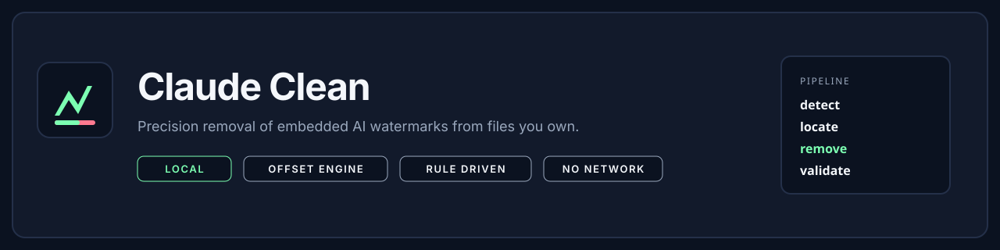
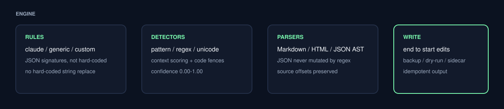

<p align="center">
  
</p>

<p align="center">
  
  
  
  
</p>

# Claude Clean

**Claude Clean** is a local, production CLI that **detects and removes** embedded Claude/AI watermark and attribution artifacts from files you own. It is an offset engine, not a `content.replace("some-string", "")` wrapper.

Detections come from versioned JSON rules. Matches are located as `[start, end)` ranges. Removals are applied from the **end of the document toward the beginning**. Surrounding Markdown, HTML, and JSON structure stays intact, then the result is parsed and hashed before anything is written.

The process never uploads files, never calls a network API, and never requires an API key.

<p align="center">
  
</p>

## Install

The package is **not published to npmjs.com** yet, so `npm install -g claude-clean` returns `E404`. Install from GitHub, or clone the repository and build it.

### Option A — global install from GitHub

Run this from any directory:

```bash
npm install -g github:anshrajore/Claude-Clean
```

Then:

```bash
claude-clean --version
```

### Option B — clone and link

```bash
git clone https://github.com/anshrajore/Claude-Clean.git
cd Claude-Clean
npm install
npm run build
npm link
```

`npm install` and `npm run build` must run **inside the cloned repo**. Running them from `~` installs whatever `package.json` exists in the home directory (or fails), which is why a Vite peer-dependency error and `Missing script: "build"` appeared.

Requires Node.js 18.18+.

## Quick start

```bash
claude-clean README.md
```

Default path: scan → detect → preview → clean. Output is `README.cleaned.md`. The original file is not overwritten unless you pass `--in-place`.

```text
Claude Clean v1.0.0
────────────

Scanning: README.md

Watermarks:
  ✓ 1 detected

✓ Watermark detected
  Type: attribution
  Location: line 148
  Confidence: 100%

Removing watermark...

✓ Watermark removed
✓ Content preserved
✓ Content validated
✓ Output written

README.cleaned.md
```

## Commands

```bash
claude-clean <file>
claude-clean clean <file>
claude-clean scan <file>
claude-clean diff <file>
claude-clean inspect <file>
claude-clean clean <directory> --recursive
claude-clean git
claude-clean git --staged
claude-clean ci
claude-clean --help
claude-clean --version
```

### Flags

| Flag | Purpose |
| --- | --- |
| `--dry-run` | Plan removals without writing |
| `--backup` | Copy the original to `*.claude-clean.bak` |
| `--overwrite-backup` | Replace an existing backup |
| `--output <file>` | Explicit output path |
| `--in-place` | Overwrite the original file |
| `--recursive` | Walk directories |
| `--include-code` | Allow matches inside fenced code / `<pre>` / `<code>` |
| `--confidence 0.95` | Minimum confidence for removal |
| `--yes` | Also remove preview-threshold matches |
| `--verbose` | Extra diagnostics |
| `--json` | Machine-readable output |
| `--no-color` | Disable ANSI color |

## Engine

<p align="center">
  
</p>

| Stage | Behavior |
| --- | --- |
| Rules | JSON documents under `rules/claude`, `rules/generic`, and `rules/custom` |
| Detectors | Literal, regex, unicode-sequence, then context scoring |
| Parsers | Markdown AST for code fences, HTML source ranges, JSON tree edits |
| Removal | `Replacement = ""` for a confirmed watermark, applied last-offset-first |
| Validation | Parse check, encoding check, SHA-256 hashes, deletion-ratio abort |

A mention of the word “Claude” in ordinary prose is not treated as a watermark. Invisible characters are reported by `inspect` and deleted only when a rule confirms a signature.

## Confidence

| Score | Behavior |
| --- | --- |
| 99–100% | Removed automatically |
| 90–98% | Removed with `--yes` |
| 70–89% | Preview / report |
| &lt;70% | Report only |

## Configuration

Place `.claude-clean.yml` in the working directory. See [`docs/claude-clean.example.yml`](docs/claude-clean.example.yml).

Custom JSON rules go in `rules/custom/` or extra directories listed in config.

## Library API

```ts
import { cleanFile, scanFile } from "claude-clean";

const result = await scanFile("README.md");

if (result.watermarks.length > 0) {
  await cleanFile("README.md");
}
```

## Safety

- Original files are not overwritten unless you pass `--in-place`
- Existing backups are not replaced without `--overwrite-backup`
- Transformations that would delete an unusually large share of the file are aborted
- Markdown code fences are protected unless `--include-code`
- JSON is parsed and edited via a JSON AST, not regex substitution
- Binary files, symlinks, huge files, and path-traversal inputs are rejected
- Cleaning is fully offline

## CI

```bash
claude-clean ci
```

Exit codes: `0` clean, `1` watermark detected, `2` error.

## Documentation

- [Architecture](docs/architecture.md)
- [Rules](docs/rules.md)
- [CLI](docs/cli.md)
- [Security](SECURITY.md)

## License

[MIT](LICENSE)
